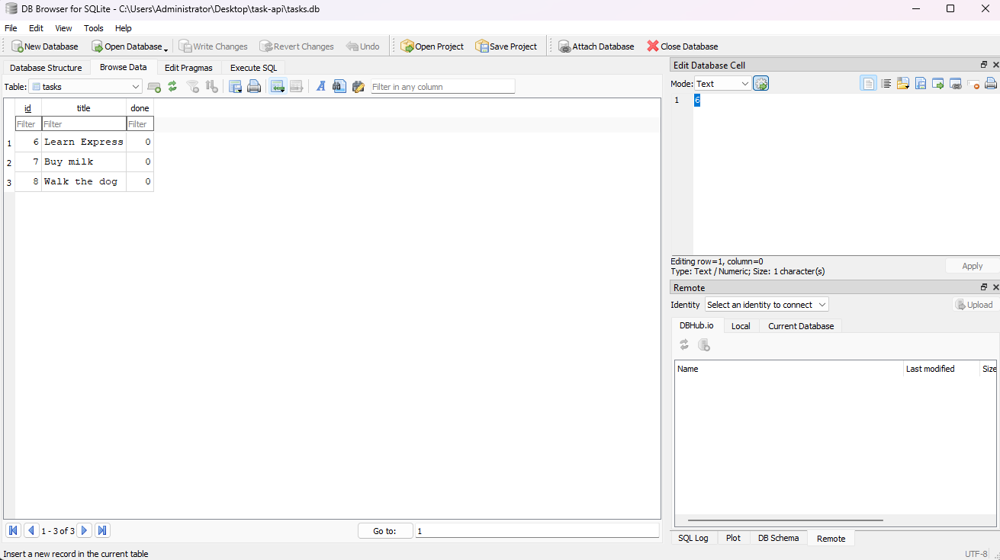

# Task API

Simple REST API for managing a to-do list. Built with Node.js and Express.

Week 2 assignment built the CRUD endpoints with an in-memory array. Week 3
Assignment A2 replaces that in-memory storage with a real SQLite database
(`tasks.db`), so tasks now survive a server restart. The API itself didn't
change - same routes, same request/response shapes, same status codes. Only
the storage layer underneath changed.

## Requirements

Node.js 20 or newer.

## Install & run

```bash
npm install
npm start
```

Server runs on http://localhost:3000
Swagger docs: http://localhost:3000/docs

The SQLite database file (`tasks.db`) is created automatically the first
time the server starts - there's nothing to set up by hand. It's git-ignored,
so a fresh clone always starts with a clean database seeded with three
example tasks.

## Database

**Why SQLite:** it needs no separate server or installation - the whole
database is a single file (`tasks.db`) that gets created automatically the
first time the app runs. That's a good fit for a small project like this one,
where the goal is persistence without any setup overhead. Bigger apps with
concurrent write-heavy workloads would eventually reach for something like
PostgreSQL, but SQLite is the right tool here.

**Where it lives:** `tasks.db`, in the project root, created automatically on
first run. It's listed in `.gitignore`, so it never gets committed - every
clone starts fresh with the seeded example tasks.

**Schema:** one table, `tasks`, with three columns:

```sql
CREATE TABLE IF NOT EXISTS tasks (
  id INTEGER PRIMARY KEY AUTOINCREMENT,
  title TEXT NOT NULL,
  done INTEGER NOT NULL DEFAULT 0
);
```

`done` is stored as `0`/`1` (SQLite has no native boolean type) and converted
back to `true`/`false` in the API responses, so the client never sees the
difference.

**Seeding:** on startup, the app counts the rows in `tasks`. If the table is
empty, it inserts three example tasks. If it's not, nothing happens - this is
what stops the examples from multiplying every time the server restarts.

**Example query** (run by hand in DB Browser for SQLite, Stage 4):

```sql
SELECT COUNT(*) FROM tasks;
```

This returned `4` at the time - the total number of tasks in the table at
that moment.

**DB Browser screenshot:**



## Endpoints

| Method | Path         | Description    | Status codes  |
| ------ | ------------ | -------------- | ------------- |
| GET    | `/`          | API info       | 200           |
| GET    | `/health`    | Health check   | 200           |
| GET    | `/tasks`     | List all tasks | 200           |
| GET    | `/tasks/:id` | Get one task   | 200, 404      |
| POST   | `/tasks`     | Create a task  | 201, 400      |
| PUT    | `/tasks/:id` | Update a task  | 200, 400, 404 |
| DELETE | `/tasks/:id` | Delete a task  | 204, 404      |

A task looks like this:

```json
{ "id": 1, "title": "Learn Express", "done": false }
```

## Validation

POST needs a `title` that is a non-empty string, otherwise it returns 400.
PUT needs at least one of `title` or `done`. `title` has to be a non-empty
string and `done` has to be a boolean.

All errors come back as JSON, for example `{ "error": "Task 99 not found" }`.

## Example requests

Creating a task:

$ curl.exe -i -X POST http://localhost:3000/tasks -H "Content-Type: application/json" -d "{"title":"Buy milk"}"

HTTP/1.1 201 Created
X-Powered-By: Express
Content-Type: application/json; charset=utf-8
Content-Length: 40
Date: Fri, 04 Sep 2026 13:32:23 GMT
Connection: keep-alive

{"id":4,"title":"Buy milk","done":false}

Asking for a task that isn't there:

$ curl.exe -i http://localhost:3000/tasks/99

HTTP/1.1 404 Not Found
X-Powered-By: Express
Content-Type: application/json; charset=utf-8
Content-Length: 29
Date: Fri, 04 Sep 2026 13:27:17 GMT
Connection: keep-alive

{"error":"Task 99 not found"}

Delete returns nothing in the body:

$ curl.exe -i -X DELETE http://localhost:3000/tasks/2

HTTP/1.1 204 No Content
X-Powered-By: Express
Date: Fri, 04 Sep 2026 13:35:20 GMT
Connection: keep-alive

If you are on Windows, PowerShell breaks the escaped quotes before curl gets
them. I lost some time on this. Adding `--%` after `curl.exe` fixes it:

```powershell
curl.exe --% -i -X POST http://localhost:3000/tasks -H "Content-Type: application/json" -d "{\"title\":\"Buy milk\"}"
```

## Swagger UI


You can test every endpoint from that page with the "Try it out" button, no
curl needed.

## Persistence

Tasks are now stored in SQLite (`tasks.db`) instead of an in-memory array. I
created a few tasks, restarted the server, and they were still there - a
restart no longer wipes the data. The database file and the `tasks` table
are both created automatically if they don't exist yet, and the three
example tasks are only seeded the first time the table is empty.

## AI vs Me (Stage 7 — AI Rematch)

In Stage 7, I generated an alternative implementation of the Task API using Claude to review its architecture against my hand-written submission. The AI-generated code and test setup are stored separately in the `ai-version/` directory.

### My Prompt

> "Build a RESTful Task API using Node.js and Express in JavaScript. Keep tasks in-memory as an array (no database, no file persistence). Each task has id (number), title (string), and done (boolean).
> Implement 5 CRUD endpoints: GET /tasks, GET /tasks/:id, POST /tasks, PUT /tasks/:id, DELETE /tasks/:id.
> Return proper HTTP status codes (200, 201, 204, 400, 404) and JSON error objects `{ "error": "..." }`. Validate that POST requires a non-empty string title, and PUT validates title (string) and done (boolean) if provided. Serve Swagger UI documentation at /docs."

---

### Code Comparison

| Feature / Aspect   | My Hand-Written Implementation                                                        | Claude's AI Implementation                                                                                              |
| :----------------- | :------------------------------------------------------------------------------------ | :---------------------------------------------------------------------------------------------------------------------- |
| **Code Structure** | Single-file monolith (`server.js`), keeping routes, logic, and state in one place.    | Modular architecture split across `app.js`, `server.js`, `tasks.js`, `taskStore.js`, `validators.js`, and `openapi.js`. |
| **OpenAPI Spec**   | Reads `openapi.json` from disk using Node's `fs.readFileSync`.                        | Exports a JavaScript object directly from `openapi.js`.                                                                 |
| **ID generation**  | `Math.max(...tasks.map(t => t.id)) + 1` — derived from existing data on every insert. | Module-scoped auto-incrementing counter (`let nextId = 1`).                                                             |
| **Error Handling** | Basic manual checks in route handlers.                                                | Custom middleware handling malformed JSON (`SyntaxError`), non-existent routes (JSON 404), and global 500 errors.       |

---

### AI Review Questions

1. **What did the AI do better — and do you understand its version well enough to explain it?**
   - **Modular Architecture:** Claude decoupled the app into isolated layers (validation, data store, routes, and server startup). I understand this well: splitting `app.js` from `server.js` allows unit testing without binding a port, while `taskStore.js` encapsulates the state so calling `store.reset()` isolates test suites.
   - **ID generation trade-off:** Claude used a module-scoped counter, I used `Math.max` over existing ids. Both avoid collisions in a running process, but they differ on restart — a counter has to be seeded from existing data, while `Math.max` derives it every time.
   - **HTTP/REST Standards:** It automatically attached a `Location` header to `201 Created` responses and handled malformed JSON requests with a proper 400 status.

2. **What did it get wrong or quietly ignore from your prompt?**
   - **Failed on First Launch (`MODULE_NOT_FOUND`):** The AI provided imports expecting a deeply nested directory structure (`./routes/tasks`, `../store/taskStore`), but gave flat files. When launched, Node immediately crashed because the path references did not match the file layout.
   - **Syntax Error in Destructuring:** A code snippet contained invalid ES6 destructuring (`const { parseId, ... }`), causing a syntax error until fixed.
   - **Missing Seed Data:** It initialized an empty array (`[]`) instead of providing initial example tasks for quick endpoint testing.

3. **What did your prompt forget to specify — and what did the AI silently decide for you?**
   - **Directory Structure:** I didn't specify file organization, so Claude chose a multi-module setup instead of a simple single-file script.
   - **Test Suite Integration:** Claude silently created helper functions (`store.reset()`) designed for automated integration tests using `node:test`.
   - **Port Collision & Extra Routes:** It included an `/openapi.json` route alongside `/docs` and assumed default port execution without checking for running instances.

---

### Prompt Iteration Rematch

- **Prompt Adjustment:** _"Provide all code formatted for a flat folder structure with correct relative require paths, pre-populated seed tasks, and a single entry file `index.js`."_
- **Result:** The second attempt produced a single-file version with pre-populated tasks and no nested imports, which was the main thing that broke the first version.
