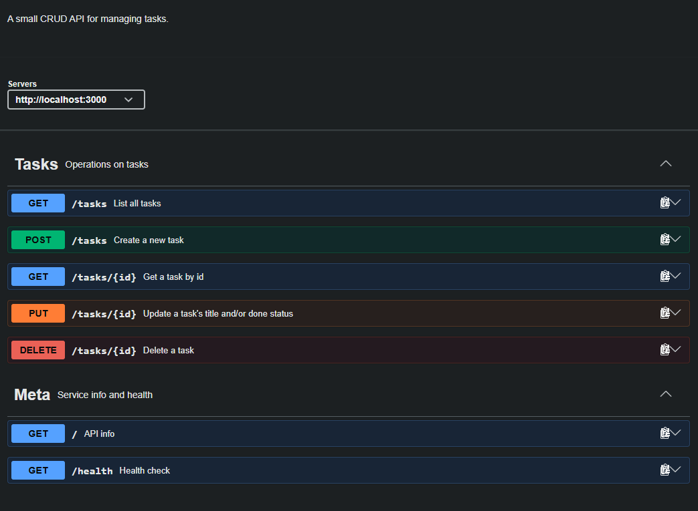

# Task API

Simple REST API for managing a to-do list. Built with Node.js and Express.

Week 2 assignment for the FlyRank internship. Tasks are kept in memory, so
everything resets when the server restarts.

## Requirements

Node.js 20 or newer.

## Install & run

```bash
npm install
npm start
```

Server runs on http://localhost:3000
Swagger docs: http://localhost:3000/docs

## Endpoints

| Method | Path | Description | Status codes |
|---|---|---|---|
| GET | `/` | API info | 200 |
| GET | `/health` | Health check | 200 |
| GET | `/tasks` | List all tasks | 200 |
| GET | `/tasks/:id` | Get one task | 200, 404 |
| POST | `/tasks` | Create a task | 201, 400 |
| PUT | `/tasks/:id` | Update a task | 200, 400, 404 |
| DELETE | `/tasks/:id` | Delete a task | 204, 404 |

A task looks like this:

```json
{ "id": 1, "title": "Learn Express", "done": false }
```

## Validation

POST needs a `title` that is a non-empty string, otherwise it returns 400.
PUT needs at least one of `title` or `done`. `title` has to be a non-empty
string and `done` has to be a boolean.

All errors come back as JSON, for example `{ "error": "Task 99 not found" }`.

## Example requests

Creating a task:

```
$ curl.exe -i -X POST http://localhost:3000/tasks -H "Content-Type: application/json" -d "{\"title\":\"Buy milk\"}"

HTTP/1.1 201 Created
X-Powered-By: Express
Content-Type: application/json; charset=utf-8
Content-Length: 40
Date: Fri, 04 Sep 2026 13:32:23 GMT
Connection: keep-alive

{"id":4,"title":"Buy milk","done":false}
```

Asking for a task that isn't there:

```
$ curl.exe -i http://localhost:3000/tasks/99

HTTP/1.1 404 Not Found
X-Powered-By: Express
Content-Type: application/json; charset=utf-8
Content-Length: 29
Date: Fri, 04 Sep 2026 13:27:17 GMT
Connection: keep-alive

{"error":"Task 99 not found"}
```

Delete returns nothing in the body:

```
$ curl.exe -i -X DELETE http://localhost:3000/tasks/2

HTTP/1.1 204 No Content
X-Powered-By: Express
Date: Fri, 04 Sep 2026 13:35:20 GMT
Connection: keep-alive
```

If you are on Windows, PowerShell breaks the escaped quotes before curl gets
them. I lost some time on this. Adding `--%` after `curl.exe` fixes it:

```powershell
curl.exe --% -i -X POST http://localhost:3000/tasks -H "Content-Type: application/json" -d "{\"title\":\"Buy milk\"}"
```

## Swagger UI



You can test every endpoint from that page with the "Try it out" button, no
curl needed.

## In-memory storage

The tasks are just a JavaScript array in the running process. I created a few
tasks, restarted the server, and they were gone - the list was back to the
three examples from the code. Nothing is written to disk anywhere, so the data
only lives as long as the process does. This is what databases are for, and
that's next week.